<div align="center">

# 🏋️ AttentiveSkel3D — Weight Training Form Error Detection

### *A Proof of Concept for Enhancing Weight Training Form Error Detection*
### *Using 3D-CNN and Biomechanical Attention Mechanism*

<br/>

[](https://www.python.org/)
[](https://pytorch.org/)
[](https://opencv.org/)
[](https://google.github.io/mediapipe/)
[](https://jupyter.org/)
[](LICENSE)
[]()
[]()

<br/>

> **Tugas Akhir — Program Studi Informatika**
> Institut Teknologi Nasional (ITENAS) Bandung · 2026

</div>

---

## 🧠 Apa Ini & Mengapa Penting?

Pernahkah Anda pergi ke gym dan berlatih sendirian tanpa pelatih? Tanpa bimbingan yang tepat, sangat mudah melakukan gerakan yang **salah** — dan kesalahan yang terlihat sepele seperti lutut masuk ke dalam saat squat, punggung membungkuk saat deadlift, atau siku terlalu terbuka saat bench press, dapat berujung pada **cedera serius** yang mengganggu aktivitas sehari-hari bahkan dalam jangka panjang.

Sayangnya, **jasa pelatih pribadi (personal trainer)** tidak terjangkau oleh semua orang. Di sinilah proyek ini hadir sebagai solusi.

### 🎯 Solusi: Pelatih Virtual Berbasis AI

**AttentiveSkel-3D** adalah sistem kecerdasan buatan yang bertindak layaknya seorang pelatih virtual. Cukup rekam latihan Anda menggunakan **kamera biasa** (tidak perlu sensor khusus), dan sistem ini akan:

| Gerakan | Yang Dideteksi |
|---|---|
| 🦵 **Squat** | Kedalaman squat kurang memadai, *knee valgus* (lutut jatuh ke dalam) |
| 🏗️ **Deadlift** | Punggung membungkuk berlebihan (*spine flexion*), posisi tidak netral |
| 🏋️ **Bench Press** | *Range of motion* siku kurang penuh, sudut lengan tidak optimal |

Sistem secara otomatis mengklasifikasikan setiap repetisi sebagai **Benar ✅** atau **Salah ❌**, memberikan umpan balik berbasis biomekanika yang selama ini hanya bisa diberikan oleh pelatih berpengalaman.

---

## ⚙️ Bagaimana Cara Kerjanya? *(Penjelasan Teknis)*

### 1. 🎥 Pipeline Pemrosesan Data

Sistem memproses video latihan melalui serangkaian tahap yang terstruktur:

```
Video .mp4  (data/raw/<Exercise>/)
      │
      ▼  [MediaPipe BlazePose — model_complexity=2]
      │  Ekstraksi 33 pose keypoints per frame → (T, 33, 4) [x, y, z, visibility]
      │
      ▼  [Preprocessing & Smoothing — src/data/preprocess.py]
      │  • Imputasi landmark hilang (interpolasi linier)
      │  • Smoothing temporal (Savitzky-Golay filter)
      │  • Normalisasi spasial (hip-centered, unit-scale)
      │  • Resampling temporal ke 64 frame tetap
      │
      ▼  Tensor Siap Model: (64, 33, 3)  — 64 frame × 33 landmark × [x, y, z]
      │
      ▼  [BiomechanicalValidator — Auto Ground Truth Labeling]
         Evaluasi sudut sendi berdasarkan referensi jurnal biomekanika:
         • Chen (2022) — Squat depth & Deadlift spine alignment
         • Rao (2023)  — Knee valgus detection
         • Ko (2024)   — Bench Press elbow ROM & Deadlift criteria
         → Label: 0 (Benar) atau 1 (Salah)
```

### 2. 🤖 Arsitektur Model: AttentiveSkel-3D

Model dirancang **ringan** namun **cerdas** dengan menggabungkan dua komponen utama:

#### 🔷 Biomechanical Attention Module

Sebelum data masuk ke jaringan konvolusi, modul atensi biomekanik memberikan **bobot berbeda** kepada setiap sendi tubuh. Sendi yang kritis secara biomekanika (misalnya lutut dan pinggul untuk squat) mendapat perhatian lebih tinggi, sehingga model berfokus pada informasi yang paling relevan.

Mekanisme atensi terdiri dari tiga komponen:
- **Spatial Prior Mask** — *learnable parameter* `(1,1,1,33,1)` yang secara implisit mempelajari kepentingan relatif tiap dari 33 sendi tubuh
- **Learned Spatial Attention** — dioptimasi bersama seluruh parameter model via *backpropagation*
- **Temporal Attention** — representasi spatio-temporal memungkinkan model menangkap pola gerakan lintas waktu

#### 🔷 3D-CNN Backbone

Setelah dibobot oleh modul atensi, data diproses oleh tiga blok konvolusi 3D yang menangkap pola spasial (konfigurasi sendi) dan temporal (pergerakan antar frame) secara bersamaan:

```
Input (B, 64, 33, 3)
  → Permute + Unsqueeze → (B, 3, 64, 33, 1)
  → ×sigmoid(Spatial Prior)              ← Biomechanical Attention
  → Conv3D Block 1: 3→32 ch, kernel(3,3,1), BN, ReLU, MaxPool
  → Conv3D Block 2: 32→64 ch, kernel(3,3,1), BN, ReLU, MaxPool
  → Conv3D Block 3: 64→128 ch, kernel(3,3,1), BN, ReLU, AdaptiveAvgPool
  → Flatten → Linear(128→64) → ReLU → Dropout(0.4) → Linear(64→2)
  → Output: [logit_Benar, logit_Salah]
```

#### 📊 Efisiensi Model

| Metrik | Nilai |
|---|---|
| Total Parameter | **101.891** |
| Ukuran Model | **~0.39 MB** |
| Input Tensor | `(B, 64, 33, 3)` |
| Output | 2 kelas (Benar / Salah) |
| Framework | PyTorch 2.x |

Model ini dirancang untuk dapat berjalan cepat bahkan tanpa GPU khusus, menjadikannya kandidat kuat untuk *deployment* pada perangkat *edge* atau aplikasi mobile di masa depan.

---

## 🗺️ Diagram Arsitektur Pipeline

```mermaid
flowchart LR
    A([🎥 Input Video\n.mp4]) --> B[MediaPipe\nBlazePose\nPose Extraction]
    B --> C[/"Sekuens Skeleton 3D\n(T × 33 × 4)"/]
    C --> D[Preprocessing\n& Smoothing\nNormalisasi + Resample]
    D --> E[/"Spatio-Temporal\nTensor\n64 × 33 × 3"/]
    E --> F[[Biomechanical\nAttention Module\nSpatial Prior Mask]]
    F --> G[[3D-CNN\nBackbone\n3 Conv3D Blocks]]
    G --> H[Global\nAverage\nPooling]
    H --> I[Fully Connected\nClassifier\n128→64→2]
    I --> J{Klasifikasi}
    J --> K([✅ Benar\nLabel: 0])
    J --> L([❌ Salah\nLabel: 1])

    style A fill:#4A90D9,stroke:#2C5F8A,color:#fff
    style E fill:#7B68EE,stroke:#4B3BAA,color:#fff
    style F fill:#E8534A,stroke:#B03028,color:#fff
    style G fill:#E8534A,stroke:#B03028,color:#fff
    style J fill:#F5A623,stroke:#C07800,color:#fff
    style K fill:#27AE60,stroke:#1A7A42,color:#fff
    style L fill:#E74C3C,stroke:#A93226,color:#fff
```



**Secara sederhana:** Video latihan Anda "dibaca" oleh sistem kamera, posisi 33 titik tubuh dilacak setiap saat, lalu pola gerakan tersebut dianalisis oleh AI yang sudah dilatih untuk membedakan gerakan benar dan salah — persis seperti seorang pelatih yang mengamati dan menilai teknik Anda.

**Secara teknis:** Video diproses frame-by-frame oleh MediaPipe BlazePose menghasilkan tensor `(T, 33, 4)`. Setelah preprocessing (interpolasi, smoothing Savitzky-Golay, normalisasi hip-centered, resampling), tensor berukuran tetap `(64, 33, 3)` dibentuk. Tensor ini dimodulasi oleh *Spatial Prior Mask* berukuran `(1,1,1,33,1)` via sigmoid sebelum memasuki tiga blok Conv3D dengan kernel `(3,3,1)` yang mengekstraksi fitur spatio-temporal. Representasi akhir di-*pool* dan diklasifikasikan oleh MLP dua lapis dengan Dropout(0.4) sebagai regularisasi.

---

## 📓 Struktur Notebook Eksperimen

| # | Notebook | Deskripsi |
|---|---|---|
| 01 | `01_pose_extraction_test.ipynb` | Uji ekstraksi pose MediaPipe BlazePose dari video |
| 02 | `02_data_preprocessing_test.ipynb` | Uji pipeline preprocessing & normalisasi skeleton |
| 02b | `02b_auto_labeling_test.ipynb` | Simulasi & verifikasi sistem pelabelan otomatis berbasis biomekanika |
| 03 | `03_model_architecture_test.ipynb` | Uji arsitektur AttentiveSkel-3D & parameter count |
| 04 | `04_dataloader_test.ipynb` | Uji bulk processing, manifest CSV, & DataLoader PyTorch |
| 05 | `05_training_test.ipynb` | Uji loop pelatihan, validasi, & penyimpanan checkpoint |
| 06 | `06_attention_visualization.ipynb` | Visualisasi Biomechanical Attention — overlay heatmap per sendi |

---

## 🗂️ Struktur Folder

```
AttentiveSkel3D-WeightTraining-PoC/
│
├── data/                        # ⚠️  Diabaikan oleh Git (.gitignore)
│   ├── raw/
│   │   ├── Squat/               # Video .mp4 gerakan Squat
│   │   ├── Deadlift/            # Video .mp4 gerakan Deadlift
│   │   └── BenchPress/          # Video .mp4 gerakan Bench Press
│   └── processed/
│       ├── tensors/             # File .npy hasil ekstraksi & preprocessing
│       └── manifest.csv         # Label otomatis + audit trail per sampel
│
├── notebooks/                   # Jupyter Notebook eksperimen (01 s.d. 06)
│
├── src/
│   ├── data/
│   │   ├── extract_pose.py      # Ekstraksi 33 keypoints via MediaPipe
│   │   ├── preprocess.py        # Smoothing, normalisasi, resampling
│   │   ├── build_dataset.py     # Pipeline bulk processing + auto-labeling
│   │   ├── dataset.py           # PyTorch Dataset & DataLoader
│   │   └── biomechanics_validator.py  # Validator otomatis berbasis jurnal
│   └── models/
│       ├── model_3dcnn.py       # Arsitektur AttentiveSkel-3D
│       └── train.py             # Training loop & checkpoint saving
│
├── models/
│   └── saved_models/            # ⚠️  Bobot .pth, diabaikan oleh Git
│
├── .gitignore
├── requirements.txt
└── README.md
```

---

## 🚀 Instalasi & Menjalankan Proyek

```bash
# 1. Clone repositori
git clone https://github.com/bangaji313/AttentiveSkel3D-WeightTraining-PoC.git
cd AttentiveSkel3D-WeightTraining-PoC

# 2. Buat dan aktifkan virtual environment
python -m venv .venv
.venv\Scripts\activate        # Windows
# source .venv/bin/activate   # Linux / macOS

# 3. Install semua dependensi
pip install -r requirements.txt

# 4. Jalankan notebook eksperimen secara berurutan
jupyter notebook notebooks/
```

> **Catatan:** Letakkan video latihan di `data/raw/<NamaLatihan>/` (contoh: `data/raw/Squat/video1.mp4`). Sistem akan secara otomatis mengekstraksi pose dan memberikan label via `BiomechanicalValidator`.

---

## 🔬 Referensi Biomekanika

Kriteria validasi gerakan dalam `BiomechanicalValidator` didasarkan **eksklusif** pada tiga publikasi ilmiah berikut:

| Referensi | Kontribusi dalam Sistem |
|---|---|
| Chen et al. (2022) | Threshold kedalaman squat (knee angle ≥ 100°) & alignment tulang belakang deadlift |
| Rao et al. (2023) | Deteksi *knee valgus* (rasio lebar lutut-per-pinggul < 0.85) |
| Ko et al. (2024) | *Elbow ROM* bench press (angle ≤ 85°) & kriteria deadlift |

---

## 🎓 Identitas Akademis

<table>
<tr>
  <td><strong>Peneliti</strong></td>
  <td>Maulana Seno Aji Yudhantara</td>
</tr>
<tr>
  <td><strong>NRP</strong></td>
  <td>152022065</td>
</tr>
<tr>
  <td><strong>Program Studi</strong></td>
  <td>Informatika — Institut Teknologi Nasional (ITENAS) Bandung</td>
</tr>
<tr>
  <td><strong>Dosen Pembimbing</strong></td>
  <td>Dr. Jasman Pardede, S.Si., M.T.</td>
</tr>
<tr>
  <td><strong>Dosen Penguji</strong></td>
  <td>
    1. Dr. sc. Lisa Kristiana, S.T., M.T., Ph.D.<br/>
    2. Prof. Dr. Edi Triono Nuryatno, B.Sc. M.Sc, MACS CT.
  </td>
</tr>
<tr>
  <td><strong>Tahun</strong></td>
  <td>2026</td>
</tr>
</table>

---

## 📈 Hasil Eksperimen dan Pembahasan

Bagian ini merangkum temuan utama penelitian dari dua sudut evaluasi:

1. Perbandingan **lima skenario arsitektur** (Baseline dan tiga ablasi terhadap Full Model)
2. Evaluasi robust menggunakan **Stratified 5-Fold Cross Validation** pada konfigurasi **50 epoch** dan **100 epoch**

### A. Definisi Lima Skenario Model

| Skenario | Konfigurasi Modul |
|---|---|
| Baseline 3D-CNN | Tanpa seluruh modul attention |
| Ablasi A — Tanpa Prior | Tanpa `biomechanical_spatial_prior` |
| Ablasi B — Tanpa Learned Spatial | Tanpa `learned_spatial_attention` |
| Ablasi C — Tanpa Temporal | Tanpa `temporal_attention` |
| Full AttentiveSkel-3D | Seluruh modul attention aktif |

Tujuan desain skenario di atas adalah mengisolasi kontribusi masing-masing komponen attention terhadap performa klasifikasi gerakan latihan beban.

### B. Hasil 5-Fold Cross Validation (50 Epoch)

Hasil ringkas pada konfigurasi 50 epoch (berdasarkan `kfold_50epochs_ranking.csv`) adalah sebagai berikut:

| Rank | Skenario | Mean Accuracy | Std Deviation |
|---|---|---:|---:|
| 1 | Ablasi B — Tanpa Learned Spatial | 96.51% | 2.47% |
| 2 | Ablasi A — Tanpa Prior | 95.90% | 2.60% |
| 3 | Full AttentiveSkel-3D | 95.29% | **2.11%** |
| 4 | Ablasi C — Tanpa Temporal | 95.08% | 2.83% |
| 5 | Baseline 3D-CNN | 94.87% | 2.82% |

Interpretasi akademis:

- Secara **rata-rata akurasi**, Ablasi B berada pada peringkat tertinggi.
- Namun, **Full AttentiveSkel-3D memiliki stabilitas terbaik** (Std Deviation terendah), yang menunjukkan generalisasi antarfold lebih konsisten.
- Baseline berada di posisi terendah, menguatkan bahwa penambahan mekanisme attention memberikan keuntungan performa dan/atau stabilitas.

### C. Hasil 5-Fold Cross Validation (100 Epoch)

Hasil ringkas pada konfigurasi 100 epoch (berdasarkan `kfold_100epochs_ranking.csv`) adalah sebagai berikut:

| Rank | Skenario | Mean Accuracy | Std Deviation |
|---|---|---:|---:|
| 1 | Ablasi A — Tanpa Prior | 95.29% | 3.65% |
| 2 | Full AttentiveSkel-3D | 95.29% | 3.87% |
| 3 | Ablasi B — Tanpa Learned Spatial | 95.08% | 3.02% |
| 4 | Baseline 3D-CNN | 94.47% | 4.20% |
| 5 | Ablasi C — Tanpa Temporal | 94.25% | 4.52% |

### D. Komparasi 50 Epoch vs 100 Epoch

Perbandingan langsung (`kfold_comparison_50_vs_100.csv`) menunjukkan pola konsisten berikut:

- Nilai **Mean Accuracy** cenderung stagnan atau menurun tipis saat epoch dinaikkan ke 100.
- Nilai **Std Deviation meningkat pada seluruh skenario** (delta positif), menandakan variansi performa antarfold makin besar.
- Fenomena ini mengindikasikan kecenderungan **overfitting**: model menjadi lebih peka terhadap noise data latih dan kurang stabil pada data validasi.

Secara praktis, konfigurasi **50 epoch** lebih disarankan karena:

1. Stabilitas hasil lebih baik (deviasi lebih rendah)
2. Efisiensi komputasi lebih tinggi (waktu latih lebih singkat)
3. Trade-off akurasi-stabilitas lebih optimal untuk konteks implementasi nyata

### E. Implikasi untuk Pengembangan Sistem

Temuan ini memberi arahan lanjutan yang penting:

- Penambahan epoch tidak selalu meningkatkan kualitas generalisasi.
- Evaluasi model sebaiknya tidak hanya mengacu pada mean accuracy, tetapi juga pada metrik stabilitas (std deviation) lintas fold.
- Arsitektur Full Model tetap relevan sebagai kandidat utama karena konsistensi performanya, khususnya untuk skenario deployment yang menuntut prediksi stabil.

---

## 📄 Lisensi

Repositori ini dikembangkan untuk keperluan akademis (Tugas Akhir). Segala bentuk penggunaan ulang harus mencantumkan atribusi yang sesuai kepada peneliti dan institusi.

[](LICENSE)

---

<div align="center">
  <sub>Built with ❤️ for academic research · ITENAS Bandung · 2026</sub>
</div>
