<div align="center">

# 🏋️ AttentiveSkel-3D V2 — Per-Frame Weight Training Form Analysis

### *Proof of Concept: Klasifikasi Kualitas Gerakan Latihan Beban Berbasis Evaluasi Spasio-Temporal Per-Frame*
### *3D-CNN dengan Biomechanical Spatial Prior, Learned Spatial Attention & Temporal Attention*

<br/>

[](https://www.python.org/)
[](https://pytorch.org/)
[](https://fastapi.tiangolo.com/)
[](https://google.github.io/mediapipe/)
[](https://opencv.org/)
[](https://doi.org/10.34740/kaggle/dsv/19041891)
[](LICENSE)
[]()
[]()
[]()

<br/>

> **📌 Post-Seminar Revision Branch (`revision/post-semhas`)**
> Cabang ini berisi seluruh implementasi, perbaikan arsitektur, retraining model, audit path cross-platform, serta benchmark latensi end-to-end hasil revisi pasca-Seminar Hasil.
> **Seluruh materi teknis dan source code aktif terpusat di folder [`Release_V2_AttentiveSkel3D/`](Release_V2_AttentiveSkel3D/).**
> 📖 Silakan merujuk ke **[Dokumentasi Teknis Release_V2_AttentiveSkel3D](Release_V2_AttentiveSkel3D/README.md)** untuk rincian eksperimen, struktur direktori, dan hasil benchmark final.

> **Tugas Akhir — Program Studi Informatika**  
> Institut Teknologi Nasional (ITENAS) Bandung · 2026

</div>

---

## 📌 Daftar Isi
1. [Latar Belakang & Urgensi Per-Frame](#-latar-belakang--urgensi-per-frame)
2. [Transparansi & Publikasi Dataset (Kaggle DOI)](#-transparansi--publikasi-dataset-kaggle-doi)
3. [Dokumentasi Pemetaan Detail Label Per-Frame (31.168 Baris)](#-dokumentasi-pemetaan-detail-label-per-frame-31168-baris)
4. [Grounding Fisik Koordinat Tensor 3D](#-grounding-fisik-koordinat-tensor-3d)
5. [Validasi Keandalan Pose Extractor & Shadow Audit (V1 vs V2)](#-validasi-keandalan-pose-extractor--shadow-audit-v1-vs-v2)
6. [Visualisasi Runtun Kerangka & Deteksi Titik Transisi Biomekanis](#-visualisasi-runtun-kerangka--deteksi-titik-transisi-biomekanis)
7. [Arsitektur Model `AttentiveSkel3DPerFrame`](#-arsitektur-model-attentiveskel3dperframe)
8. [Tiga Modul Atensi Spasio-Temporal](#-tiga-modul-atensi-spasio-temporal)
9. [Hasil Evaluasi Eksperimen & K-Fold Cross Validation](#-hasil-evaluasi-eksperimen--k-fold-cross-validation)
10. [Galeri Grafik Analisis & Visualisasi Atensi](#-galeri-grafik-analisis--visualisasi-atensi)
11. [Struktur Proyek & File Evaluasi](#-struktur-proyek--file-evaluasi)
12. [Aplikasi Demo Inferensi Real-Time](#-aplikasi-demo-inferensi-real-time)
13. [Panduan Instalasi & Replikasi](#-panduan-instalasi--replikasi)
14. [Referensi Ilmiah](#-referensi-ilmiah)
15. [Identitas Akademis](#-identitas-akademis)

---

## 🎯 Latar Belakang & Urgensi Per-Frame

Kesalahan postur saat latihan beban (*weight training*) — seperti lutut kolaps ke dalam (*knee valgus*) saat **Squat**, punggung membungkuk berlebihan (*excessive lumbar flexion*) saat **Deadlift**, atau rentang gerak siku yang tidak penuh (*half rep*) saat **Bench Press** — merupakan pemicu utama cedera muskuloskeletal akut maupun kronis.

### Perbedaan Paradigma: V1 vs V2

| Aspek | V1 (Video-Level Classification) | V2 (Per-Frame Spatio-Temporal AI) |
|---|---|---|
| **Pertanyaan Klinis** | *"Apakah video repetisi ini secara keseluruhan benar/salah?"* | *"Di frame dan detik ke-berapa deviasi postur mulai terjadi?"* |
| **Output Model** | `(B, 2)` — 1 label per video | `(B, 64, 2)` — **64 logit per-frame independen** |
| **Dimensi Temporal** | Dihancurkan oleh *Global Average Pooling* (GAP) | **Dipertahankan penuh** via Landmark-only pooling + upsampling |
| **Sinyal Gradien Loss** | 1 gradien per sampel video | **64 gradien per sampel** ($B \times 64 = 1.024$ gradien/batch) |
| **Actionable Feedback** | Hanya ringkasan akhir (kurang informatif) | **Deteksi transisi instan** BENAR $\leftrightarrow$ SALAH frame-demi-frame |

```diff
# Perubahan Inti Arsitektur Forward Pass:
- x = x.mean(dim=[2, 3, 4])    # V1: GAP menghancurkan sumbu waktu
- x = self.classifier(x)       # Output: (B, 2)

+ x = self.landmark_pool(x)    # V2: AdaptiveAvgPool3d hanya pada dimensi landmark
+ x = F.interpolate(x, size=(64,1), mode="bilinear") # Upsample waktu kembali ke T=64
+ x = x.permute(0, 2, 1)       # (B, 64, 128)
+ x = self.classifier(x)       # Output: (B, 64, 2) -> Klasifikasi per-frame!
```

---

## 🌐 Transparansi & Publikasi Dataset (Kaggle DOI)

Untuk menjamin prinsip keterbukaan ilmiah dan keterulangan riset (*reproducibility*), seluruh video rekaman mentah bersolusi tinggi (HD) telah dipublikasikan secara terbuka di platform Kaggle:

- 🔗 **Kaggle Dataset:** [AttentiveSkel-3D Weight Training Error Dataset V2](https://www.kaggle.com/datasets/bangaji/attentiveskel-3d-weight-training-error-dataset)
- 📌 **DOI Publikasi:** [`10.34740/kaggle/dsv/19041891`](https://doi.org/10.34740/kaggle/dsv/19041891)
- 📊 **Cakupan Data:** 487 video latihan beban (total 507 video raw) yang mencakup 3 jenis latihan utama (*Bench Press*, *Deadlift*, *Squat*) dari sudut pandang *Frontal*, *Lateral*, dan *Sekunder*.

---

## 📋 Dokumentasi Pemetaan Detail Label Per-Frame (31.168 Baris)

Sebagai bukti transparansi mutlak antara video mentah dan tensor komputasi, disediakan dokumen *one-row-per-frame*:
- 📁 **File CSV:** [`Release_V2_AttentiveSkel3D/hasil_evaluasi/Pemetaan_Detail_Per_Frame_V2.csv`](Release_V2_AttentiveSkel3D/hasil_evaluasi/Pemetaan_Detail_Per_Frame_V2.csv)
- 📁 **File JSON:** [`Release_V2_AttentiveSkel3D/hasil_evaluasi/Pemetaan_Detail_Per_Frame_V2.json`](Release_V2_AttentiveSkel3D/hasil_evaluasi/Pemetaan_Detail_Per_Frame_V2.json)

**Statistik Dokumen:**
- Tepat **31.168 baris data** ($487 \text{ video} \times 64 \text{ frame}$), di luar baris header.
- Menghubungkan secara matematis: `Nama_Dataset` $\rightarrow$ `Nama_Video_Mentah` $\rightarrow$ `Latihan` $\rightarrow$ `Temporal_Index` (1–64) $\rightarrow$ `Label_Biner` (0=BENAR, 1=SALAH) $\rightarrow$ `Source_Frame_Index` $\rightarrow$ `Timestamp_Sec` $\rightarrow$ `Tensor_Path` $\rightarrow$ `Label_Path`.

| Nama_Dataset | Nama_Video_Mentah | Latihan | Temporal_Index | Label_Biner | Status_Label | Source_Frame_Index | Timestamp_Sec |
|---|---|:---:|:---:|:---:|:---:|:---:|:---:|
| `BenchPress_001` | `primer_benchpress_frontal_subjek01_rep1.mp4` | Benchpress | 1 | 1 | SALAH | 0 | 0.0000 |
| `BenchPress_001` | `primer_benchpress_frontal_subjek01_rep1.mp4` | Benchpress | 32 | 0 | BENAR | 44 | 1.4667 |
| `Squat_057` | `sekunder_squat_frontal_subjek03_rep7.mp4` | Squat | 51 | 0 | BENAR | 80 | 2.6667 |
| `Squat_057` | `sekunder_squat_frontal_subjek03_rep7.mp4` | Squat | 52 | 1 | SALAH | 82 | 2.7333 |

---

## 📐 Grounding Fisik Koordinat Tensor 3D

Tensor $(64, 33, 3)$ pada file `.npy` **bukan nilai piksel semu atau probabilitas**, melainkan **koordinat spasio-temporal 3D tubuh manusia** yang telah melalui normalisasi fisik:

```
[Video Mentah]           → MediaPipe BlazePose (model_complexity=2)
                         → Array mentah (T, 33, 4): [x_img, y_img, z_rel, visibility]
[Translasi Mid-Hip]      → Mid-Hip = (Left_Hip[23] + Right_Hip[24]) / 2 dijadikan titik pusat (0, 0, 0)
[Penskalaan Torso]       → Dibagi panjang torso = ||Mid_Shoulder - Mid_Hip|| (invarian skala & jarak kamera)
[Resampling Temporal]    → Interpolasi linier tepat T=64 frame berjarak seragam (0.0 s/d 1.0)
```

### Bukti Grounding Numerik Aktual (`BenchPress_001.npy`)

Pengujian langsung pada tensor terproses menunjukkan grounding anatomis yang presisi:
- **Pusat Pinggul ($t=0$):**
  - `Left Hip  (idx 23)` = `[-0.1560, -0.0041,  0.0067]`
  - `Right Hip (idx 24)` = `[ 0.1560,  0.0041, -0.0067]`
  - $\rightarrow$ Titik tengah persis $(0, 0, 0)$, membuktikan simetri panggul terhadap origin.
- **Bahu Kiri ($t=0$, idx 11):** `[-0.3273, 0.2012, -1.0163]` ($\approx 0.33$ unit torso ke kiri dari sumbu tubuh).
- **Siku Kanan ($t=31$, idx 14):** `[ 0.7093, 0.1137, -0.6947]` (posisi ekstensi lengan lateral).
- **Rentang Global Nilai Tensor:** Min = $-1.6450$, Max = $+0.8016$ (seluruh sendi berada dalam radius wajar proporsi tubuh manusia).

---

## 🔬 Validasi Keandalan Pose Extractor & Shadow Audit (V1 vs V2)

Untuk memastikan bahwa kualitas ekstraksi pose MediaPipe BlazePose andal dan tidak menghasilkan label artifisial akibat oklusi, dilakukan **Shadow Audit V1 vs V2** pada seluruh **31.168 frame** ([`Label_Audit_V1_vs_V2.json`](Release_V2_AttentiveSkel3D/hasil_evaluasi/Label_Audit_V1_vs_V2.json)).

### Hasil Komparasi Label Global:

| Kategori Transisi Status | Jumlah Frame | Persentase | Makna Teknis |
|---|:---:|:---:|---|
| **Unchanged BENAR** | 9.652 | 30.97% | Gerakan valid secara biomekanik & seluruh landmark kunci terdeteksi sempurna |
| **Unchanged SALAH** | 16.844 | 54.04% | Gerakan melanggar batas biomekanik pada landmark valid |
| **BENAR $\rightarrow$ INVALID_POSE** | 3.860 | 12.38% | Landmark sendi esensial teroklusi/low-visibility $\rightarrow$ status diamankan |
| **SALAH $\rightarrow$ INVALID_POSE** | 812 | 2.61% | Oklusi sendi kritis sehingga rule tidak dapat dievaluasi secara valid |
| **BENAR $\rightarrow$ SALAH (Label Flip)** | **0** | **0.00%** | **Nol kontradiksi label** |
| **SALAH $\rightarrow$ BENAR (Label Flip)** | **0** | **0.00%** | **Nol kontradiksi label** |
| **TOTAL UNCHANGED (Stabilitas GT)** | **26.496** | **85.01%** | **Kualitas Ground Truth sangat konsisten & valid** |

### Breakdown Kestabilan per Latihan:
- **Deadlift:** **100.0% Unchanged** (8.256/8.256 frame stabil, 0 INVALID) karena vektor tulang belakang (*Shoulder–Hip*) selalu terlihat jelas.
- **Squat:** **81.36% Unchanged** (8.904 frame stabil, 2.040 frame INVALID pada sudut fleksi ekstrim).
- **Bench Press:** **78.01% Unchanged** (9.336 frame stabil, 2.632 frame INVALID akibat oklusi pergelangan tangan oleh *barbell plate* pada tampak frontal).

---

## 🎬 Visualisasi Runtun Kerangka & Deteksi Titik Transisi Biomekanis

Visualisasi di bawah ini diekstraksi langsung dari koordinat *raw image-space* video asli (tanpa distorsi tensor) dan diarsir dengan status validator biomekanik:
- 🟩 **Hijau:** Postur memenuhi kriteria biomekanik valid.
- 🟥 **Merah:** Postur melanggar batas ambang biomekanik (*error form*).

---

### 1. Squat (`Squat_057`) — Transisi `BENAR` $\rightarrow$ `SALAH` (Hip Flexion / Depth Violation)
Pada gerakan Squat, kriteria Rao et al. (2023) mensyaratkan sudut fleksi pinggul (*Bahu–Pinggul–Lutut*) mencapai $\le 137.0^\circ$ pada titik terbawah. Pada repetisi ini, subjek mengalami kelelahan sehingga pada saat naik kembali, sudut pinggul melebar melebihi batas toleransi:

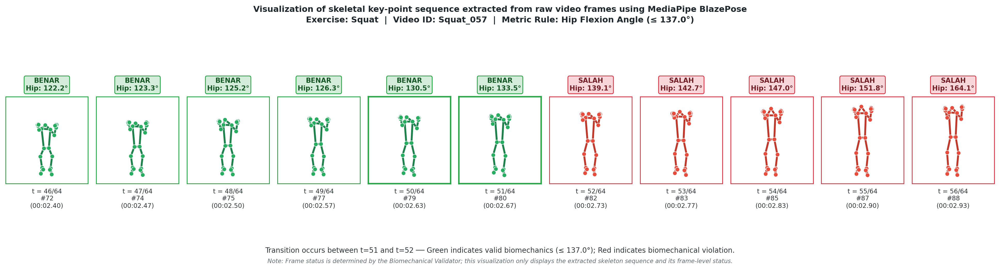

> **Analisis Gambar:** Transisi terjadi tepat antara frame $t=51$ (sudut pinggul $133.52^\circ$, status `BENAR`) dan frame $t=52$ (sudut pinggul $139.08^\circ$, status `SALAH`). Terlihat jelas pada frame $t=52$ ke atas bahwa kedalaman squat mulai berkurang (*half rep*).

---

### 2. Bench Press (`BenchPress_034`) — Transisi `BENAR` $\rightarrow$ `SALAH` (Elbow ROM Violation)
Berdasarkan Chen et al. (2022), sudut fleksi siku (*Bahu–Siku–Pergelangan Tangan*) harus mencapai $\le 85.0^\circ$ saat barbel berada pada titik terendah dekat dada untuk menjamin *Full Range of Motion*:

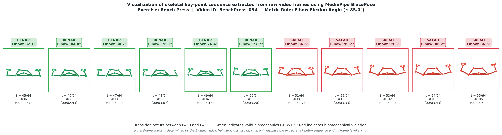

> **Analisis Gambar:** Transisi terjadi antara frame $t=50$ (sudut siku $77.71^\circ$, status `BENAR`) dan frame $t=51$ (sudut siku $86.55^\circ$, status `SALAH`). Frame merah menunjukkan barbel tidak diturunkan secara penuh (*insufficient elbow flexion*).

---

### 3. Deadlift (`Deadlift_002`) — Transisi `SALAH` $\rightarrow$ `BENAR` (Spine Inclination Recovery)
Sesuai Chen et al. (2022), inklinasi sudut tulang belakang terhadap garis vertikal wajib berada pada rentang aman $20.0^\circ \le \theta \le 60.0^\circ$. Sudut $> 60.0^\circ$ menandakan *excessive lumbar flexion* (punggung membungkuk berisiko cedera):

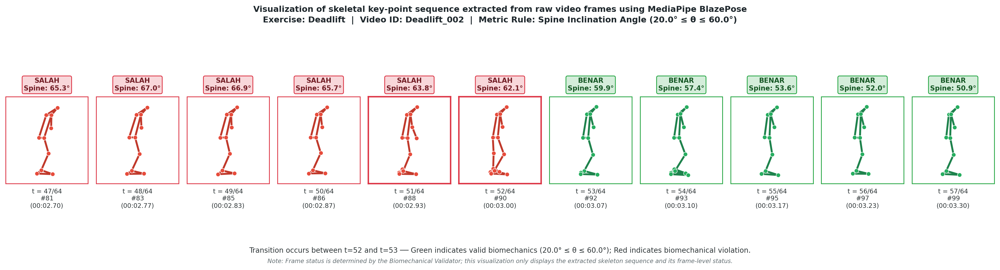

> **Analisis Gambar:** Transisi pemulihan terjadi antara frame $t=52$ (inklinasi $62.08^\circ$, status `SALAH` / punggung terlalu membungkuk saat awal angkatan) dan frame $t=53$ (inklinasi $59.86^\circ$, status `BENAR` saat pinggul terkunci dan torso tegak).

---

### 4. Strip Overlay Kerangka pada Frame Video Mentah Asli

Berikut adalah bukti overlay skeleton MediaPipe BlazePose di atas frame video mentah HD untuk membuktikan ketepatan alignment anatomis:

| Squat Overlay Strip | Bench Press Overlay Strip | Deadlift Overlay Strip |
|:---:|:---:|:---:|
| 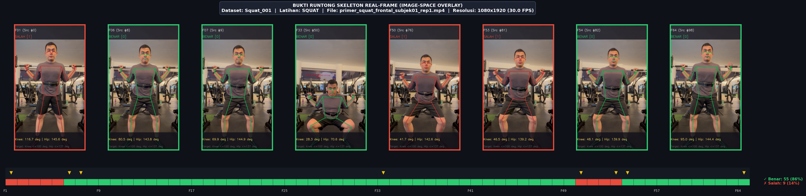 | 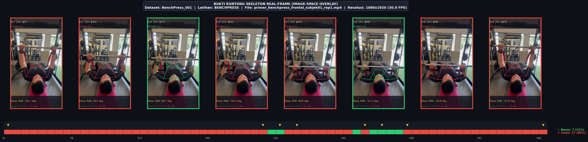 | 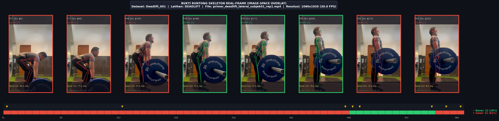 |

---

## 🤖 Arsitektur Model `AttentiveSkel3DPerFrame`

```
INPUT: (B, 64, 33, 3) — Batch × 64 Frame × 33 Landmark × 3 Koordinat XYZ
  │
  ├─ Reshape & Unsqueeze → (B, 3, 64, 33, 1)  [Format Conv3d Spasio-Temporal]
  │
  ├─ [BSP] Biomechanical Spatial Prior  ← 33 parameter learnable per-sendi (Sigmoid)
  │         (1, 1, 1, 33, 1) × Input     ← Penguatan sendi fungsional
  │
  ├─ Conv Block 1: Conv3d(3→32, (3,3,1)) + BN + ReLU + MaxPool(1,2,1)
  │                Output: (B, 32, 64, 16, 1)   [Landmark: 33→16, Waktu TETAP 64]
  │
  ├─ Conv Block 2: Conv3d(32→64, (3,3,1)) + BN + ReLU + MaxPool(2,2,1)
  │                Output: (B, 64, 32, 8, 1)    [Landmark: 16→8, Waktu: 64→32]
  │
  ├─ Conv Block 3: Conv3d(64→128, (3,3,1)) + BN + ReLU  (Tanpa Pooling)
  │                Output: (B, 128, 32, 8, 1)   [Ekspansi representasi fitur]
  │
  ├─ [LS] Learned Spatial Attention    ← SE-Style MLP: GAP → Linear(128→32→128) → Sigmoid
  │         Broadcast bobot channel ke (B, 128, 32, 8, 1)
  │
  ├─ [TA] Temporal Attention           ← Conv3d(128→1, (1,1,1)) → Softmax(dim=waktu)
  │         Skoring kepentingan frame kritis sepanjang sumbu waktu
  │
  ├─ Landmark Pooling                  ← AdaptiveAvgPool3d(output_size=(None, 1, 1))
  │         (B, 128, 32, 8, 1) → (B, 128, 32, 1, 1)  [Pool HANYA landmark, Waktu TETAP]
  │
  ├─ Temporal Upsampling (Bilinear)    ← F.interpolate(size=(64, 1), mode="bilinear")
  │         (B, 128, 32, 1) → (B, 128, 64, 1) → squeeze → (B, 128, 64)
  │
  ├─ Permute                           → (B, 64, 128)  [Siap untuk linear per-frame]
  │
  └─ Classifier Head                   ← Linear(128→64) → ReLU → Dropout(0.4) → Linear(64→2)

OUTPUT: (B, 64, 2) — 64 pasang logit per-frame [logit_BENAR, logit_SALAH]
```

### Profil Parameter & Efisiensi Komputasi

| Layer / Modul | Tipe Layer | Output Shape | Jumlah Parameter | % Parameter |
|---|---|---|:---:|:---:|
| `bsp_weights` | Learnable Parameter | `(1, 1, 1, 33, 1)` | **33** | 0.03% |
| `conv_block_1` | Conv3d + BN + ReLU | `(B, 32, 64, 16, 1)` | **928** | 0.84% |
| `conv_block_2` | Conv3d + BN + ReLU | `(B, 64, 32, 8, 1)` | **18.560** | 16.82% |
| `conv_block_3` | Conv3d + BN + ReLU | `(B, 128, 32, 8, 1)` | **73.984** | 67.03% |
| `learned_spatial` | MLP SE-Style (Linear×2) | `(B, 128)` | **8.352** | 7.57% |
| `temporal_attn` | Conv3d ($1\times1\times1$) | `(B, 1, 32, 1, 1)` | **129** | 0.12% |
| `classifier` | Linear(128→64→2) | `(B, 64, 2)` | **8.386** | 7.60% |
| **TOTAL KESELURUHAN** | — | — | **110.372** | **100.0%** |

- ⚡ **Ukuran Checkpoint Model (.pth):** **0.44 MB**
- ⚡ **Komputasi MACs:** **39.62 Mega-MACs** (Sangat ringan, sanggup inferensi real-time $\ge 60\text{ FPS}$ pada GPU RTX 3060 Ti).

---

## 🔬 Tiga Modul Atensi Spasio-Temporal

### 1. Biomechanical Spatial Prior (BSP)
Modul berparameter 33 skalar yang diinisialisasi $1.0$ dan dilatih secara *end-to-end*. Setelah aktivasi Sigmoid, model belajar memprioritaskan sendi penggerak utama:
- 🦵 **Right Knee:** Bobot **0.7742** (#1)
- 💪 **Right Elbow:** Bobot **0.7693** (#2)
- 🦵 **Left Knee:** Bobot **0.7551** (#5)
- 💪 **Left Elbow:** Bobot **0.7496** (#7)
- 🖐️ **Left Pinky (Jari Kelingking):** Bobot **0.6633** (#33 - paling rendah)

### 2. Learned Spatial Attention (SE-Style)
Mengompresi representasi spasio-temporal global menjadi vektor 128D via *channel pooling*, lalu memetakan korelasi antar-channel fitur menggunakan MLP berasio kompresi $4\times$.

### 3. Temporal Attention
Menghitung skor probabilitas kepentingan tiap frame dengan normalisasi Softmax di sepanjang sumbu waktu, memberikan bobot lebih tinggi pada fase transisi kritis (posisi terdalam squat, titik terendah barbel bench press).

---

## 📊 Hasil Evaluasi Eksperimen & K-Fold Cross Validation

### A. Evaluasi Holdout Test Set (4.736 Frame dari 73 Video Test, Seed=42)
*Sumber: [`Perbandingan_Metrik_Semua_Skenario_V2.csv`](Release_V2_AttentiveSkel3D/hasil_evaluasi/Perbandingan_Metrik_Semua_Skenario_V2.csv)*

| ID | Skenario Model | BSP | LS | Temp | Accuracy | F1-Macro | F1-Binary | Precision | Recall |
|:---:|---|:---:|:---:|:---:|:---:|:---:|:---:|:---:|:---:|
| **S1** | **Baseline (Tanpa Atensi)** | ✗ | ✗ | ✗ | **90.94%** | **0.9066** | **0.9229** | 0.9087 | 0.9376 |
| **S2** | **Full Model (BSP + LS + Temp)** | ✓ | ✓ | ✓ | 88.03% | 0.8776 | 0.8956 | 0.9031 | 0.8883 |
| **S3a** | **Ablasi: Hanya BSP** | ✓ | ✗ | ✗ | 90.31% | 0.9002 | 0.9171 | **0.9077** | 0.9266 |
| **S3b** | **Ablasi: BSP + Learned Spatial** | ✓ | ✓ | ✗ | 88.43% | 0.8812 | 0.9003 | 0.8971 | 0.9036 |
| **S3c** | **Ablasi: BSP + Temporal** | ✓ | ✗ | ✓ | 89.67% | 0.8924 | 0.9141 | 0.8808 | **0.9500** |

---

### B. Stratified 5-Fold Cross Validation (100 Epoch per Fold, 487 Video)
*Sumber: [`KFold_Ringkasan_Semua_Skenario_V2.csv`](Release_V2_AttentiveSkel3D/hasil_evaluasi/KFold_Ringkasan_Semua_Skenario_V2.csv)*

| ID | Skenario Model | Accuracy (Mean ± Std) | F1-Macro (Mean ± Std) | F1-Binary (Mean ± Std) |
|:---:|---|:---:|:---:|:---:|
| **S1** | Baseline | 91.32% ± 0.96% | 0.9113 ± 0.0092 | 0.9235 ± 0.0108 |
| **S2** | Full Model | 91.02% ± 1.73% | 0.9079 ± 0.0172 | 0.9216 ± 0.0175 |
| **S3a** | **Ablasi: Hanya BSP** | **91.82% ± 1.18%** | **0.9163 ± 0.0115** | **0.9281 ± 0.0118** |
| **S3b** | **Ablasi: BSP + Learned Spatial** | **91.82% ± 1.75%** | **0.9165 ± 0.0171** | 0.9272 ± 0.0180 |
| **S3c** | **Ablasi: BSP + Temporal** | 91.08% ± 1.50% | 0.9086 ± 0.0142 | 0.9218 ± 0.0164 |

> 📌 **Kesimpulan Kunci Evaluasi:**
> 1. Pada pengujian 5-Fold Cross Validation yang merata di seluruh dataset, **Skenario 3a (Hanya BSP)** mengungguli seluruh model dengan akurasi **91.82%** dan F1-Score **0.9163**. Penambahan hanya 33 parameter memberikan peningkatan stabilitas nyata tanpa resiko *overfitting*.
> 2. **Skenario 3c (BSP + Temporal)** memiliki **Recall tertinggi (95.00%)** dengan nilai *False Negative* terendah (hanya 137 frame salah yang lolos), menjadikannya konfigurasi paling ideal untuk pencegahan risiko cedera.

---

## 📈 Galeri Grafik Analisis & Visualisasi Atensi

| Perbandingan Metrik Semua Skenario | Distribusi Akurasi K-Fold 5 Lipatan |
|:---:|:---:|
| 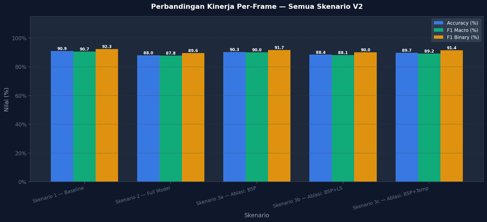 | 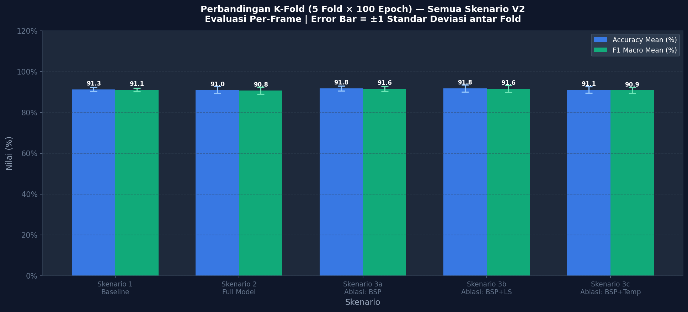 |

| Matriks Kebingungan (Confusion Matrix) | Sebaran Bobot Atensi Spasial (BSP) |
|:---:|:---:|
| 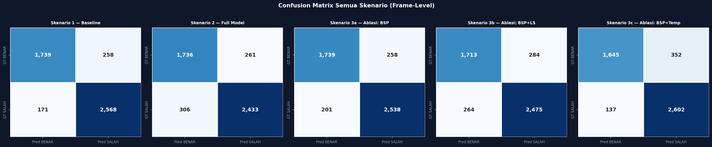 | 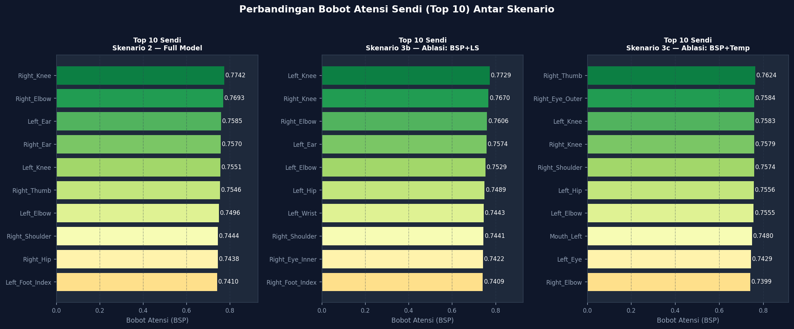 |

### Visualisasi 3D Skeleton Heatmap Atensi (3 Gerakan)
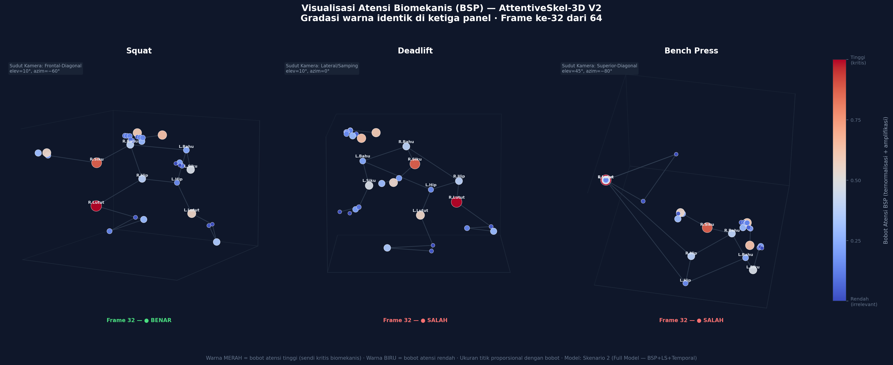

---

## 🗂️ Struktur Proyek & File Evaluasi

```
Release_V2_AttentiveSkel3D/
├── data/
│   ├── manifest_v2.csv                  # Manifest 487 pasang tensor & label
│   └── Bukti_Wujud_Tensor_V2.csv        # Ekspor nilai koordinat tensor mentah
│
├── src/
│   ├── data/
│   │   ├── extract_pose.py              # Ekstraksi BlazePose model_complexity=2
│   │   ├── preprocess.py                # Pipeline filter-smooth-normalize-resample
│   │   ├── biomechanics_validator.py    # Auto-labeling rule-based ilmiah
│   │   ├── shadow_audit_validator_v2.py # Audit V1 vs V2 (3 status)
│   │   ├── audit_preprocessing_zero_fill.py # Audit zero-fill & low visibility
│   │   ├── generate_pemetaan_detail_per_frame_v2.py # Generator 31.168 rows mapping
│   │   └── dataset_v2.py                # PyTorch Dataset & DataLoader per-frame
│   │
│   ├── models/
│   │   ├── arsitektur_v2.py             # AttentiveSkel3DPerFrame (110k params)
│   │   ├── train_v2.py                  # Training loop B×64 loss per-frame
│   │   ├── evaluate_v2.py               # Evaluator holdout test set
│   │   ├── evaluasi_semua_skenario_v2.py# Evaluasi komparatif 5 skenario
│   │   └── kfold_semua_skenario_v2.py   # Stratified 5-Fold Cross Validation
│   │
│   └── visualization/
│       └── generate_transition_sequences.py # Visualizer sekuens transisi biomekanik
│
├── bobot_model/
│   ├── best_model_baseline.pth          # Checkpoint S1
│   ├── best_model_v2.pth                # Checkpoint S2
│   ├── best_model_ablasi_a.pth          # Checkpoint S3a
│   ├── best_model_ablasi_b.pth          # Checkpoint S3b
│   └── best_model_ablasi_c.pth          # Checkpoint S3c
│
├── hasil_evaluasi/
│   ├── Pemetaan_Detail_Per_Frame_V2.csv # 31.168 baris pemetaan frame
│   ├── Label_Audit_V1_vs_V2.csv / .json # Hasil komparasi Shadow Audit
│   ├── Perbandingan_Metrik_Semua_Skenario_V2.csv # Tabel hasil test set
│   ├── KFold_Ringkasan_Semua_Skenario_V2.csv     # Tabel hasil K-Fold CV
│   ├── Sequence_Transition_Squat_Final.png       # Bukti transisi Squat
│   ├── Sequence_Transition_BenchPress_Final.png  # Bukti transisi Bench Press
│   ├── Sequence_Transition_Deadlift_Final.png    # Bukti transisi Deadlift
│   └── composite_overlay_viz/           # Gambar strip overlay frame nyata
│
└── web_app/
    ├── app_v2.py                        # Server FastAPI streaming SSE
    ├── inference_core_v2.py             # Pipeline inferensi per-frame
    └── templates/index_v2.html          # Web UI responsif & visualizer
```

---

## 🌐 Aplikasi Demo Inferensi Real-Time

Sistem dilengkapi aplikasi inferensi berbasis **FastAPI** dan **Server-Sent Events (SSE)** untuk memproses video input secara interaktif:

```bash
# 1. Pastikan environment conda aktif
conda activate attentiveskel

# 2. Jalankan server aplikasi
cd Release_V2_AttentiveSkel3D
python web_app/app_v2.py

# 3. Buka peramban -> http://localhost:8080
```

---

## 🚀 Panduan Instalasi & Replikasi

```bash
# 1. Clone repositori branch V2
git clone -b v2-per-frame-ai https://github.com/bangaji313/AttentiveSkel3D-WeightTraining-PoC.git
cd AttentiveSkel3D-WeightTraining-PoC

# 2. Buat environment Conda
conda create -n attentiveskel python=3.10 -y
conda activate attentiveskel

# 3. Install dependensi
pip install -r requirements.txt

# 4. Jalankan evaluasi semua skenario
python Release_V2_AttentiveSkel3D/src/models/evaluasi_semua_skenario_v2.py

# 5. Jalankan K-Fold Cross Validation
python Release_V2_AttentiveSkel3D/src/models/kfold_semua_skenario_v2.py
```

---

## 📚 Referensi Ilmiah

1. **Chen, K.-Y., et al. (2022).** *"Fitness Movement Types and Completeness Detection Using a Transfer-Learning-Based Deep Neural Network."* Sensors.
2. **Rao, P., Asha, C. S., & Rao, R. P. (2023).** *"Real-time Posture Correction of Squat Exercise: A Deep Learning Approach for Performance Analysis and Error Correction."* IEEE Access.
3. **Ko, Y.-M., Nasridinov, A., & Park, S.-H. (2024).** *"Real-Time AI Posture Correction for Powerlifting Exercises Using YOLOv5 and MediaPipe."* Applied Sciences.
4. **Hu, J., Shen, L., & Sun, G. (2018).** *"Squeeze-and-Excitation Networks."* IEEE CVPR.
5. **Bazarevsky, V., et al. (2020).** *"BlazePose: On-device Real-time Body Pose Tracking."* CVPR Workshop.

---

## 🎓 Identitas Akademis

<table>
<tr>
  <td><strong>Peneliti / Mahasiswa</strong></td>
  <td>Maulana Seno Aji Yudhantara (NRP: 152022065)</td>
</tr>
<tr>
  <td><strong>Program Studi</strong></td>
  <td>Informatika — Institut Teknologi Nasional (ITENAS) Bandung</td>
</tr>
<tr>
  <td><strong>Dosen Pembimbing</strong></td>
  <td>Dr. Jasman Pardede, S.Si., M.T.</td>
</tr>
<tr>
  <td><strong>Dosen Penguji</strong></td>
  <td>
    1. Dr. sc. Lisa Kristiana, S.T., M.T., Ph.D.<br/>
    2. Prof. Dr. Edi Triono Nuryatno, B.Sc. M.Sc, MACS CT.
  </td>
</tr>
<tr>
  <td><strong>Tahun Sidang</strong></td>
  <td>2026</td>
</tr>
</table>

---

<div align="center">
  <sub>AttentiveSkel-3D V2 · Built with ❤️ for academic research · ITENAS Bandung · 2026</sub>
</div>
